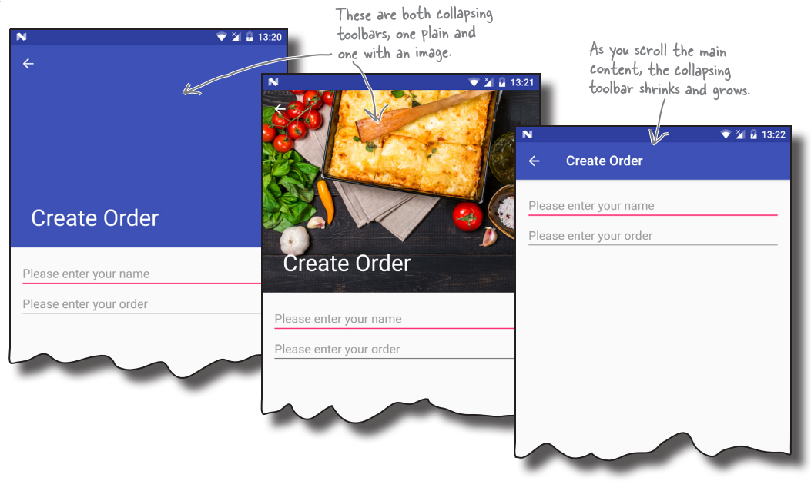

# Top bar

## История

ActionBar (Только заголовок) => Toolbar (заголовок и меню, кнопки) => MaterialToolbar (+ анимации, сложные заголовки (CollapsingToolbarLayout), скрытие части заголовков)


*сложный заголовок*

## Современная структура

**Можно использовать просто** [Toolbar](https://developer.android.com/reference/androidx/appcompat/widget/Toolbar) или его наследник [**MaterialToolbar**](https://developer.android.com/reference/com/google/android/material/appbar/MaterialToolbar), который реализует особенности материального дизайна.

В случае, если необходимо при скроллинге контента скрытие табов или заголовка приложения, или сложный заголовок приложения (большой заголовок с картинкой переходящий в обычный заголовок приложения), тогда необходимо использовать вложенную структуру элементов:

- [CoordinatorLayout](https://developer.android.com/reference/kotlin/androidx/coordinatorlayout/widget/CoordinatorLayout) - корневой элемент для layout c двумя дочерними элементами:

  - [AppBarLayout](https://developer.android.com/reference/com/google/android/material/appbar/AppBarLayout) - вертикальный LinearLayout, который реализует особенности материального дизайна, а именно, жести прокрутки (скрывает часть заголовков в зависимости от действий пользователя). AppBarLayout должен быть прямым дочерним элементом в CoordinatorLayout, иначе большая часть функциональности не будет работать. Дочерние элементы обеспечивают желаемое поведение через установку атрибута `app:layout_scrollFlags` (возможные значения флага указаны в описании метода [`AppBarLayout.LayoutParams.setScrollFlags(int)`](https://developer.android.com/reference/com/google/android/material/appbar/AppBarLayout.LayoutParams#setScrollFlags(int))), например, `app:layout_scrollFlags="scroll"` (Чтобы происходило движение обязательно надо указать флаг `scroll`. Что бы получить желаемую реакцию на на движение следует комбинировать флаги. Подробнее в [cтатье](https://medium.com/martinomburajr/android-design-collapsing-toolbar-scrollflags-e1d8a05dcb02))

    - [CollapsingToolbarLayout](https://developer.android.com/reference/com/google/android/material/appbar/CollapsingToolbarLayout) или, **если не нужна функциональность CollapsingToolbarLayout** (показана на рисунке выше - сложный заголовок), **MaterialToolbar или Toolbar и, при необходимости, строку с табами TabLayout**. Что бы при схлопывании остался Toolbar нужно указать флаг для CollapsingToolbarLayout `app:layout_scrollFlags="scroll|exitUntilCollapsed"` и исчезла картинка и Toolbar окрасился в нужный цвет `app:contentScrim="?attr/colorPrimary"`. В CollapsingToolBarLayout добавляем два дочерних элемента:

      - ImageView (при необходимости, если не добавлен, будет сплошной цвет) с флагом `app:layout_collapseMode="parallax"` который двигает картинку при скроллинге основного контента с эффектом параллакса (медленнее, чем основной контент)

      - Toolbar или MaterialToolbar с флагом `app:layout_collapseMode="pin"`, что бы элементы управления Toolbar (Например, меню) были закреплены в верхней части окна и не сдвигались при скроллинге.

  - Основной контент в NestedScrollView или RecyclerView. Необходимо установить значение атрибута `app:layout_behavior="@string/appbar_scrolling_view_behavior"` (или, что то же самое, `app:layout_behavior="com.google.android.material.appbar.AppBarLayout$ScrollingViewBehavior"`)

    - NestedScrollView в котором размещаем один любой дочерний Layout с прокручиваемым контентом

    - RecyclerView (или ViewPager)

## Примеры кода

### Начальная настройка для всех

В манифесте указана тема, которая используется приложением

```xml
    <application
        ...
        android:theme="@style/Theme.RoomTest3"
        >
        ...
    </application>
```

В нашей теме (в начальном приложении файлы values/themes.xml и values-night/themes.xml) меняем родителя для темы на тему без ActionBar

```xml
<resources xmlns:tools="http://schemas.android.com/tools">
    <!-- Base application theme. -->
    <style name="Theme.RoomTest3"
           parent="Theme.MaterialComponents.DayNight.NoActionBar">
        ...
    </style>
</resources>
```

Далее добавляем Toolbar. Высоту Toolbar, независимо от способа использования установить `?attr/actionBarSize`.
Также устанавливаем id (Например, toolbar), и в коде активити в OnCreate() устанавливаем как toolbar

```kotlin
setSupportActionBar(findViewById(R.id.toolbar))
```

При использовании ViewBinding

```kotlin
setSupportActionBar(binding.toolbar)
```

### Простое использование Toolbar

В activity_main.xml в корневом Layout размещаем MaterialToolbar

```xml
<?xml version="1.0" encoding="utf-8"?>
<androidx.constraintlayout.widget.ConstraintLayout
    android:id="@+id/root"
    xmlns:android="http://schemas.android.com/apk/res/android"
    xmlns:app="http://schemas.android.com/apk/res-auto"
    xmlns:tools="http://schemas.android.com/tools"
    android:layout_width="match_parent"
    android:layout_height="match_parent"
    >
    
    
    <com.google.android.material.appbar.MaterialToolbar
        android:id="@+id/toolbar"
        android:layout_width="match_parent"
        android:layout_height="?attr/actionBarSize"
        app:layout_constraintTop_toTopOf="parent"
        app:menu="@menu/menu_main"
        />
    
    <Button
        android:id="@+id/createAction"
        android:layout_width="wrap_content"
        android:layout_height="wrap_content"
        android:text="Create Action"
        app:layout_constraintEnd_toEndOf="parent"
        app:layout_constraintStart_toStartOf="parent"
        app:layout_constraintTop_toBottomOf="@+id/toolbar"
        />

</androidx.constraintlayout.widget.ConstraintLayout>
```

### Скрывающийся Toolbar

Не забудьте выполнить начальные настройки, обязательные для всех

```xml
<?xml version="1.0" encoding="utf-8"?>
<androidx.coordinatorlayout.widget.CoordinatorLayout
    xmlns:android="http://schemas.android.com/apk/res/android"
    xmlns:app="http://schemas.android.com/apk/res-auto"
    xmlns:tools="http://schemas.android.com/tools"
    android:layout_width="match_parent"
    android:layout_height="match_parent"
    >
    
    <com.google.android.material.appbar.AppBarLayout
        android:id="@+id/appbar"
        android:layout_width="match_parent"
        android:layout_height="wrap_content"
        >
        
        <androidx.appcompat.widget.Toolbar
            android:id="@+id/toolbar"
            android:layout_width="match_parent"
            android:layout_height="?attr/actionBarSize"
            app:layout_scrollFlags="scroll|enterAlways"
            />
    
    </com.google.android.material.appbar.AppBarLayout>
    
    <androidx.core.widget.NestedScrollView
        android:layout_width="match_parent"
        android:layout_height="match_parent"
        
        
        app:layout_behavior="com.google.android.material.appbar.AppBarLayout$ScrollingViewBehavior"
        >
        
        <androidx.constraintlayout.widget.ConstraintLayout
            android:layout_width="match_parent"
            android:layout_height="match_parent"
            tools:context=".MainActivity"
            >
            
            <TextView
                android:layout_width="wrap_content"
                android:layout_height="wrap_content"
                android:text="Hello World!"
                app:layout_constraintBottom_toBottomOf="parent"
                app:layout_constraintLeft_toLeftOf="parent"
                app:layout_constraintRight_toRightOf="parent"
                app:layout_constraintTop_toTopOf="parent"
                />
        
        </androidx.constraintlayout.widget.ConstraintLayout>
    
    </androidx.core.widget.NestedScrollView>

</androidx.coordinatorlayout.widget.CoordinatorLayout>
```

### Toolbar с TabLayout для навигации

```xml
<?xml version="1.0" encoding="utf-8"?>
<androidx.coordinatorlayout.widget.CoordinatorLayout
    xmlns:android="http://schemas.android.com/apk/res/android"
    xmlns:tools="http://schemas.android.com/tools"
    xmlns:app="http://schemas.android.com/apk/res-auto"
    
    android:layout_width="match_parent"
    android:layout_height="match_parent"
    >
    
    <com.google.android.material.appbar.AppBarLayout
        android:id="@+id/appbar"
        android:layout_height="wrap_content"
        android:layout_width="match_parent"
        >
    
        <com.google.android.material.appbar.MaterialToolbar
            android:id="@+id/toolbar"
            android:layout_height="?attr/actionBarSize"
            android:layout_width="match_parent"
            app:layout_scrollFlags="scroll|enterAlways|snap"
            />
        
        <com.google.android.material.tabs.TabLayout
            android:id="@+id/tabs"
            android:layout_width="match_parent"
            android:layout_height="wrap_content"
            app:tabMode="scrollable"
            >
            
            <com.google.android.material.tabs.TabItem
                android:layout_height="wrap_content"
                android:layout_width="wrap_content"
                android:text="Tab1"
                />
            
            <com.google.android.material.tabs.TabItem
                android:layout_height="wrap_content"
                android:layout_width="wrap_content"
                android:text="Tab2"
                />
            
            <com.google.android.material.tabs.TabItem
                android:layout_height="wrap_content"
                android:layout_width="wrap_content"
                android:text="Tab3"
                />
        </com.google.android.material.tabs.TabLayout>
    </com.google.android.material.appbar.AppBarLayout>
    
    <androidx.core.widget.NestedScrollView
        android:layout_width="match_parent"
        android:layout_height="match_parent"
        
        app:layout_behavior="com.google.android.material.appbar.AppBarLayout$ScrollingViewBehavior"
        >
        
        <androidx.constraintlayout.widget.ConstraintLayout
            android:layout_width="match_parent"
            android:layout_height="match_parent"
            >
            
            <Button
                android:id="@+id/createAction"
                android:layout_width="wrap_content"
                android:layout_height="wrap_content"
                android:layout_marginTop="8dp"
                android:text="Create Action"
                app:layout_constraintEnd_toEndOf="parent"
                app:layout_constraintStart_toStartOf="parent"
                app:layout_constraintTop_toTopOf="parent"
                />
        
        </androidx.constraintlayout.widget.ConstraintLayout>
    </androidx.core.widget.NestedScrollView>

</androidx.coordinatorlayout.widget.CoordinatorLayout>
```

### CollapsingToolbar

```xml
<?xml version="1.0" encoding="utf-8"?>
<androidx.coordinatorlayout.widget.CoordinatorLayout
    xmlns:android="http://schemas.android.com/apk/res/android"
    xmlns:tools="http://schemas.android.com/tools"
    xmlns:app="http://schemas.android.com/apk/res-auto"
    android:layout_width="match_parent"
    android:layout_height="match_parent"
    >
    
    <com.google.android.material.appbar.AppBarLayout
        android:id="@+id/appbar"
        android:layout_height="192dp"
        android:layout_width="match_parent"
        >
        
        <com.google.android.material.appbar.CollapsingToolbarLayout
            android:layout_width="match_parent"
            android:layout_height="match_parent"
            app:toolbarId="@+id/toolbar"
            app:layout_scrollFlags="scroll|exitUntilCollapsed"
            app:layout_scrollInterpolator="@android:anim/decelerate_interpolator"
            app:contentScrim="?attr/colorPrimary"
            >
            
            <ImageView
                android:id="@+id/app_bar_image"
                android:layout_width="match_parent"
                android:layout_height="match_parent"
                android:src="@drawable/screenshot"
                android:scaleType="centerCrop"
                />
    
            <com.google.android.material.appbar.MaterialToolbar
                android:id="@+id/toolbar"
                android:layout_height="?attr/actionBarSize"
                android:layout_width="match_parent"
                app:layout_collapseMode="pin"
                />
        </com.google.android.material.appbar.CollapsingToolbarLayout>
    </com.google.android.material.appbar.AppBarLayout>
    
    <androidx.core.widget.NestedScrollView
        android:layout_width="match_parent"
        android:layout_height="match_parent"
        app:layout_behavior="com.google.android.material.appbar.AppBarLayout$ScrollingViewBehavior"
        >
        
        <androidx.constraintlayout.widget.ConstraintLayout
            android:layout_width="match_parent"
            android:layout_height="match_parent"
            >
            
            <Button
                android:id="@+id/createAction"
                android:layout_width="wrap_content"
                android:layout_height="wrap_content"
                android:layout_marginTop="8dp"
                android:text="Create Action"
                app:layout_constraintEnd_toEndOf="parent"
                app:layout_constraintStart_toStartOf="parent"
                app:layout_constraintTop_toTopOf="parent"
                />
        
        </androidx.constraintlayout.widget.ConstraintLayout>
    
    </androidx.core.widget.NestedScrollView>


</androidx.coordinatorlayout.widget.CoordinatorLayout>
```

#### Возможные проблемы

Если Toolbar не исчезает (не становится прозрачным) при использовании CollapsingToolbarLayout, то возможно переопределена тема для Toolbar, и необходимо искать проблему в определении стиля.

## Добавление меню

Добавляем меню в `res/menu/menu_main.xml` (считаем, что строковые ресурсы добавлены ранее)

```xml
<?xml version="1.0" encoding="utf-8"?>
<menu
    xmlns:app="http://schemas.android.com/apk/res-auto"
    xmlns:android="http://schemas.android.com/apk/res/android">
    
    <item
        android:id="@+id/action_favorite"
        android:icon="@android:drawable/btn_star"
        android:title="@string/menu_favorite"
        app:showAsAction="ifRoom"
        />
    <item
        android:id="@+id/action_settings"
        android:title="@string/menu_settings"
        app:showAsAction="never"
        />
</menu>
```

Устанавливаем Toolbar c id=toolbar, как ActionBar для Activity (это дублирование информации из общего раздела, для комментария ниже)

```kotlin
class MainActivity : AppCompatActivity() {
    override fun onCreate(savedInstanceState: Bundle?) {
        ...
        setSupportActionBar(findViewById(R.id.toolbar))
    }
}
```

Согласно исходному коду `AppCompatActivity#onCreateOptionsMenu` и [ответу](https://stackoverflow.com/questions/63761776/setsupportactionbar-removes-menu-items), основанном на исходном коде, в случае, если Toolbar установлен как ActionBar для Activity, то за создание меню и обработку нажатий кнопок меню отвечает Activity. Т.е. установка меню в xml `app:menu="@menu/menu_main"` не приведет к желаемому результату (при `setSupportActionBar` меню исчезнет)

В активити перегружаем методы `onCreateOptionsMenu` (создание меню) и `onOptionsItemSelected` (обработка нажатий кнопок)

```kotlin
override fun onCreateOptionsMenu(menu: Menu?): Boolean {
    menuInflater.inflate(R.menu.menu_main, menu)
    return true
}

override fun onOptionsItemSelected(item: MenuItem): Boolean = 
when (item.itemId) {
    R.id.action_favorite -> {
        Snackbar
            .make(findViewById(R.id.createAction),
                R.string.menu_favorite,
                Snackbar.LENGTH_SHORT)
            .show()
        true
    }
    R.id.action_settings -> {
        Snackbar
            .make(findViewById(R.id.createAction),
                R.string.menu_settings,
                Snackbar.LENGTH_SHORT)
            .show()
        true
    }
    else -> super.onOptionsItemSelected(item)
}
```

Примечание: Snackbar использован только для примера. При этом, в [документации](https://material.io/components/snackbars/android#using-snackbars) указано, что Snackbar лучше работает с CoordinatorLayout (swipe-to-dismiss и перемещение FloatingActionButton автоматически), поэтому, наверное CoordinatorLayout лучше использовать даже для простого использования Toolbar. В качестве View можно указать любой View, у которого есть родитель CoordinatorLayout (ну или любой другой, если CoordinatorLayout не используется)

## Добавление up-button

По [инструкции](https://developer.android.com/training/appbar/up-action)